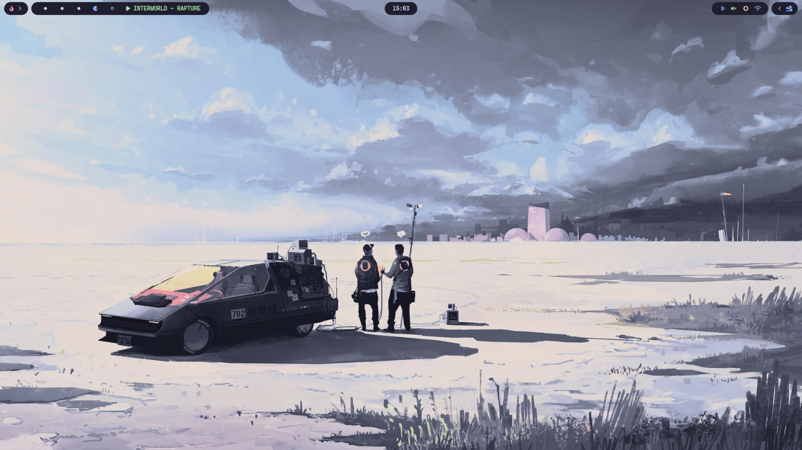
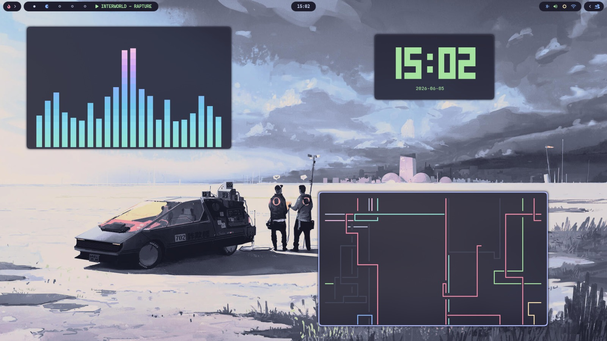
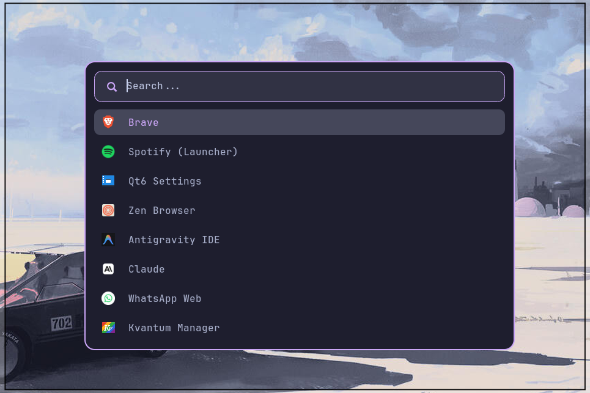
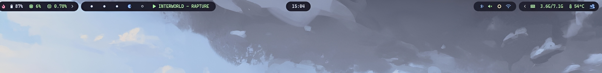

# 🌟 arslan48 Dotfiles

A highly customized, modular, and aesthetic **Hyprland** desktop environment configured in **Catppuccin Mocha** style. Built with the native **Lua configuration format** (Hyprland v0.55+), it features smooth animations, dynamic window managers, custom scripts, and sliding status bar drawers.

---

## 📸 Showcase

Here is a preview of the workspace in action:

<video src="assets/screenshots/hyprlandsetup.mp4" width="100%" controls autoplay loop muted></video>

### Desktop & Widgets
| Clean Workspace | Widgets & Windows |
| :---: | :---: |
|  |  |

### Waybar & Rofi Launcher
| Rofi Application Launcher | Waybar Sliding Status Panel |
| :---: | :---: |
|  |  |

---

## ✨ Features

- **🌀 Modular Lua Config**: Pure Lua configurations (`hyprland.lua` and `modules/`) replacing the legacy `hyprlang` syntax for easier setup, native scripting, and conditions.
- **📊 Waybar with Sliding Drawers**: A top bar designed with nested sliding panels (`drawer` components) that hide system metrics (CPU, RAM, load, battery, temperature) until clicked, keeping the desktop uncluttered.
- **🚀 Wallpaper Picker Menu**: Press `SUPER + W` to select a wallpaper interactively using **Rofi** and **Awww** (the modern Rust successor to `swww`) with smooth zoom transitions.
- **💻 Kitty Terminal**: Styled with Catppuccin Mocha, featuring JetBrains Mono Nerd Font, transparency, blur, and custom cursor trails.
- **🎨 Audio & System Visualizers**: Real-time terminal styling with **Btop** and **Cava** (with custom Catppuccin color gradients).
- **🖼️ Fastfetch Customization**: Configured with a retro-modern Kitty image renderer displaying a custom profile (`marin.png`).

---

## 📦 Dependencies & Packages

To get this setup working completely, you will need the following packages. They are grouped below by function:

| Component | Package / Tool Name | Description |
| :--- | :--- | :--- |
| **Window Manager** | `hyprland` *(v0.55+ for Lua config support)* | Core Wayland compositor |
| **Terminal** | `kitty` | Main GPU-accelerated terminal |
| **Status Bar** | `waybar` | Status bar with sliding groups |
| **Launcher & Menu** | `rofi-wayland`, `rofi-emoji` | Application launcher and emoji selector |
| **Wallpaper Daemon** | `awww` *(or `awww-git`)* | Successor to `swww` for animated wallpaper transitions |
| **Notification Center** | `swaync` | Sway Notification Center for alerts |
| **System Info & Fetch** | `fastfetch` | Retro styled system information tool |
| **System Monitor** | `btop`, `htop`, `nvtop`, `mission-center` | Terminal and GUI resource monitors |
| **Audio Visualizer** | `cava` | Console-based audio visualizer |
| **Fonts & Icons** | `ttf-jetbrains-mono-nerd`, `ttf-font-awesome` | Fonts for terminal and Waybar widgets |
| **Sound / Volume** | `pipewire`, `wireplumber`, `pavucontrol`, `playerctl` | Volume and media controllers |
| **Backlight** | `brightnessctl` | Screen brightness manager |
| **Screenshots** | `grim`, `slurp`, `wl-copy` | Screen capture and clipboard manager |
| **Settings & Appearance** | `nwg-look`, `qt6ct`, `kvantum` | Theme customizers for GTK/QT apps |
| **Default Applications** | `dolphin`, `brave`, `code` (VS Code) | Default file manager, browser, and editor |
| **CLI Extras** | `peaclock`, `alacritty` | Clock visualizer and secondary terminal for scripts |

---

## 🚀 Installation Guide

> [!NOTE]
> This guide is tailored for **Arch Linux** but can be adapted for any distribution. Make sure your Hyprland version is `v0.55` or later to support the native Lua config schema.

### Step 1: Clone the Repository
Clone the dotfiles repository into your home directory:
```bash
git clone https://github.com/arslan48/dotfiles.git ~/dotfiles
cd ~/dotfiles
```

### Step 2: Install Dependencies
Install all official repository packages and AUR packages (using `yay` or any other AUR helper):

```bash
# 1. Install packages from the official repositories
sudo pacman -S hyprland kitty waybar rofi swaync fastfetch btop cava pipewire wireplumber pavucontrol playerctl brightnessctl grim slurp wl-copy dolphin networkmanager bluez blueman htop powertop qt6ct

# 2. Install AUR dependencies (including Awww, fonts, and helpers)
yay -S awww-git peaclock-git mission-center nwg-look-bin kvantum ttf-jetbrains-mono-nerd rofi-emoji
```

### Step 3: Copy Configurations

```bash
# 1. (Optional) Backup your existing configuration directory
mv ~/.config ~/.config.bak

# 2. Create the target config folder if it doesn't exist
mkdir -p ~/.config

# 3. Copy configurations recursively from the repository
cp -r ~/dotfiles/hypr ~/.config/
cp -r ~/dotfiles/kitty ~/.config/
cp -r ~/dotfiles/waybar ~/.config/
cp -r ~/dotfiles/rofi ~/.config/
cp -r ~/dotfiles/fastfetch ~/.config/
cp -r ~/dotfiles/cava ~/.config/
cp -r ~/dotfiles/btop ~/.config/
```


### Step 4: Configure Wallpapers
The custom **wallpaper picker** (`SUPER + W`) searches for wallpapers in:
```bash
~/Downloads/CozyPixels/Catppuccin
```
Ensure you create this directory and place your wallpapers there, or modify `rofi/wall-picker.sh` to match your custom wallpaper directory:
```bash
# Edit line 3 in ~/.config/rofi/wall-picker.sh to change path:
WALL_DIR="$HOME/Downloads/CozyPixels/Catppuccin"
```

---

## ⌨️ Keybindings Cheat Sheet

Here are the primary hotkeys configured in [hypr/modules/binds.lua](file:///home/arslan/dotfiles/hypr/modules/binds.lua):

### Applications

| Keybind | Action |
| :--- | :--- |
| `SUPER + Enter` | Open Terminal (**Kitty**) |
| `SUPER + E` | Open File Manager (**Dolphin**) |
| `SUPER + C` | Open Application Launcher (**Rofi**) |
| `SUPER + B` | Open Browser (**Brave**) |
| `SUPER + X` | Open Text Editor (**VS Code**) |
| `SUPER + W` | Open **Wallpaper Picker** |
| `SUPER + .` | Open **Emoji Selector** |

### Window & Workspace Control

| Keybind | Action |
| :--- | :--- |
| `SUPER + Shift + Q` | Close active window |
| `SUPER + F` | Toggle fullscreen |
| `SUPER + Space` | Toggle floating state (auto-resizes and centers window) |
| `SUPER + V` | Toggle dwindle split (`togglesplit`) |
| `SUPER + H/J/K/L` (or Arrow keys) | Focus left/down/up/right |
| `SUPER + Shift + H/J/K/L` (or Arrow keys) | Move active window left/down/up/right |
| `SUPER + U/I/O/P` | Resize window (repeating keys) |
| `SUPER + [1-10]` | Switch to workspace 1-10 |
| `SUPER + Shift + [1-10]` | Move active window to workspace 1-10 |
| `SUPER + ~` (Grave key) | Toggle Special Workspace (Scratchpad) |
| `SUPER + Shift + ~` | Move active window to Special Workspace |
| `SUPER + S / A` | Navigate to next / previous workspace |
| `SUPER + D` | Switch to previous workspace per monitor |

### Media & Volume

| Keybind | Action |
| :--- | :--- |
| `Print` | Screenshot selected area (saves to clipboard) |
| `Shift + Print` | Screenshot entire screen (saves to clipboard) |
| `AudioRaiseVolume` / `AudioLowerVolume` | Adjust system volume (using `wpctl`) |
| `AudioMute` | Mute/unmute audio sink |
| `MonBrightnessUp` / `MonBrightnessDown` | Adjust screen brightness (using `brightnessctl`) |
| `AudioNext` / `AudioPrev` / `AudioPlay` / `AudioPause` | Media controls (using `playerctl`) |
---
## 🙏 Credits

A huge thanks to the open-source community for making ricing possible and fun. Special credit goes to:

| Author | Project | Contribution |
| :--- | :--- | :--- |
| [**cebem1nt**](https://github.com/cebem1nt/dotfiles) | `cebem1nt/dotfiles` | Base Waybar layout and sliding drawer concept — heavily customized and adapted for this setup |
| [**ayanrajpoot10**](https://github.com/ayanrajpoot10/dotfiles) | `ayanrajpoot10/dotfiles` | Base Fastfetch configuration — customized to match the Catppuccin Mocha theme |

## 📄 License

This setup is open-source under the **MIT License**. Check out the [LICENSE](file:///home/arslan/dotfiles/LICENSE) file for more information.
