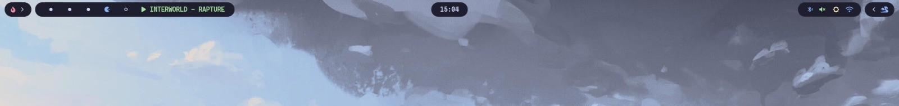

# arslan48 Hyprland Dotfiles

A clean Catppuccin-inspired Hyprland desktop built around the modern Lua
configuration format, Waybar, Rofi, Kitty, SwayNC, AWWW wallpapers, and a small
set of terminal utilities.

> This is a personal setup. Read the install notes before copying it over an
> existing desktop, because these files replace your current app configs.

## Preview




[Watch the setup recording](assets/screenshots/hyprlandsetup.mp4)

## What Is Included

| Path | Purpose |
| --- | --- |
| `hypr/` | Hyprland Lua config split into modules for monitors, binds, autostart, theme, input, layout, and window rules. |
| `waybar/` | Top bar with grouped drawers, workspace status, MPRIS, system stats, network, Bluetooth, volume, brightness, power profile, tray, and calendar. |
| `rofi/` | App launcher, emoji mode, and wallpaper picker styling. |
| `kitty/` | Transparent Catppuccin Mocha terminal config using JetBrains Mono Nerd Font. |
| `fastfetch/` | Fastfetch config with image support. |
| `cava/` | Audio visualizer config. |
| `btop/` | Catppuccin Mocha btop theme. |

## Requirements

This setup is written for a recent Hyprland release with Lua config support.
Hyprland's current documentation uses `~/.config/hypr/hyprland.lua` as the main
config path, and the official install page recommends using your distribution's
packaged Hyprland instead of manually building or mixing `-git` packages unless
you know exactly what you are doing.

Tested target:

- Linux desktop with Wayland
- Hyprland `0.55+`
- Arch Linux or an Arch-based distribution
- PipeWire/WirePlumber audio stack
- NetworkManager

For other distributions, install the equivalent package names from your package
manager.

## Dependencies

### Core Desktop

```bash
sudo pacman -S \
  hyprland xdg-desktop-portal-hyprland xdg-desktop-portal-gtk \
  waybar kitty rofi-wayland swaync \
  pipewire wireplumber pipewire-pulse pavucontrol \
  networkmanager network-manager-applet bluez bluez-utils blueman \
  brightnessctl playerctl grim slurp wl-clipboard \
  dolphin polkit-kde-agent
```

### Appearance, Fonts, and Icons

```bash
sudo pacman -S \
  ttf-jetbrains-mono-nerd ttf-cascadia-code-nerd \
  papirus-icon-theme nwg-look qt5ct qt6ct kvantum \
  qt5-wayland qt6-wayland
```

Fonts used by the configs:

- `JetBrainsMono Nerd Font` for Kitty and Rofi
- `CaskaydiaCove Nerd Font Propo` for Waybar icons/text

If icons look like boxes, install the Nerd Fonts above and rebuild the font
cache:

```bash
fc-cache -fv
```

### Utilities Used By Modules and Keybinds

```bash
sudo pacman -S \
  fastfetch btop cava htop jq libnotify \
  alacritty nvtop powertop power-profiles-daemon \
  awww mission-center
```

Optional tools used by this config:

```bash
yay -S brave-bin visual-studio-code-bin peaclock
```

Notes:

- `awww-daemon` is started from Hyprland autostart and `awww img ...` is used by
  the wallpaper picker.
- `brave`, `code`, `missioncenter`, `peaclock`, and `nvtop` are referenced by
  keybinds or Waybar context menu actions. Replace them if you use different
  apps.
- The Waybar Bluetooth module calls `~/.local/bin/toggle_bluetooth`; control
  center actions also reference `~/.local/bin/refreshrate`,
  `~/.local/bin/caffeine`, and `~/.local/bin/powersafe`. Add those scripts or
  remove the actions from `waybar/modules.jsonc`.

## Installation

### 1. Clone The Repository

```bash
git clone https://github.com/arslan48/dotfiles.git ~/dotfiles
cd ~/dotfiles
```

### 2. Backup Existing Configs

```bash
mkdir -p ~/.config-backup
cp -r ~/.config/hypr ~/.config/waybar ~/.config/rofi ~/.config/kitty \
  ~/.config/fastfetch ~/.config/cava ~/.config/btop ~/.config-backup/ 2>/dev/null
```

### 3. Copy Dotfiles

Use `rsync` so directories are copied cleanly:

```bash
rsync -av --delete hypr/ ~/.config/hypr/
rsync -av --delete waybar/ ~/.config/waybar/
rsync -av --delete rofi/ ~/.config/rofi/
rsync -av --delete kitty/ ~/.config/kitty/
rsync -av --delete fastfetch/ ~/.config/fastfetch/
rsync -av --delete cava/ ~/.config/cava/
rsync -av --delete btop/ ~/.config/btop/
```

Make scripts executable:

```bash
chmod +x ~/.config/rofi/scripts/wall-picker.sh
chmod +x ~/.config/rofi/wall-picker.sh
chmod +x ~/.config/waybar/scripts/launch.sh
```

### 4. Enable Services

```bash
sudo systemctl enable --now NetworkManager
sudo systemctl enable --now bluetooth
systemctl --user enable --now pipewire pipewire-pulse wireplumber
```

Optional but recommended on laptops:

```bash
sudo systemctl enable --now power-profiles-daemon
```

### 5. Start Hyprland

Log out and select Hyprland from your display manager, or start it from a TTY:

```bash
Hyprland
```

## Important User Changes

Some paths and apps are personal to my machine. Update these before using the
setup as your daily driver.

### Wallpaper Directory

The wallpaper picker currently reads:

```bash
~/Downloads/CozyPixels/Catppuccin
```

Change `WALL_DIR` in:

```text
rofi/scripts/wall-picker.sh
rofi/wall-picker.sh
```

### Hardcoded Username Path

The Hyprland bind for the wallpaper picker currently uses:

```lua
/home/arslan/.config/rofi/scripts/wall-picker.sh
```

Change it in:

```text
hypr/modules/binds.lua
```

Recommended replacement:

```lua
hl.bind("SUPER + W", hl.dsp.exec_cmd("~/.config/rofi/scripts/wall-picker.sh"))
```

### Default Apps

Edit these values in `hypr/modules/binds.lua` if needed:

```lua
local terminal    = "kitty"
local fileManager = "dolphin"
local menu        = "rofi -show drun"
local browser     = "brave"
local editor      = "code"
```

## Keybinds

| Keybind | Action |
| --- | --- |
| `SUPER + Return` | Open Kitty |
| `SUPER + E` | Open Dolphin |
| `SUPER + C` | Open Rofi app launcher |
| `SUPER + B` | Open Brave |
| `SUPER + X` | Open VS Code |
| `SUPER + Shift + Q` | Close focused window |
| `SUPER + Shift + R` | Reload Hyprland |
| `SUPER + Shift + E` | Exit Hyprland |
| `SUPER + H/J/K/L` | Focus window left/down/up/right |
| `SUPER + Shift + H/J/K/L` | Move window left/down/up/right |
| `SUPER + U/P/O/I` | Resize focused window |
| `SUPER + Space` | Toggle floating and center window |
| `SUPER + F` | Toggle fullscreen |
| `SUPER + 1-0` | Switch workspace 1-10 |
| `SUPER + Shift + 1-0` | Move window to workspace 1-10 |
| `SUPER + A/S` | Previous/next workspace |
| `SUPER + D` | Previous workspace on monitor |
| `SUPER + Grave` | Toggle special workspace |
| `SUPER + Shift + Grave` | Move window to special workspace |
| `SUPER + W` | Open wallpaper picker |
| `SUPER + Period` | Open Rofi emoji mode |
| `Print` | Select area screenshot and copy to clipboard |
| `Shift + Print` | Full screenshot and copy to clipboard |

## Waybar

The Waybar setup has:

- Hyprland workspace icons
- MPRIS media title and controls
- Click-to-reveal grouped modules
- Battery, CPU, load, memory, and temperature
- Volume and brightness sliders
- Network context menu
- Bluetooth status
- Calendar tooltip
- Power profile indicator
- SwayNC control center button
- Tray

Reload Waybar manually:

```bash
~/.config/waybar/scripts/launch.sh
```

If Waybar does not start, run it from a terminal to see the error:

```bash
waybar
```

## Rofi

Rofi is configured with:

- `drun`
- `window`
- `emoji`
- icon display
- Papirus icon theme
- JetBrains Mono Nerd Font
- wallpaper picker with image previews

Run the launcher:

```bash
rofi -show drun
```

Run the wallpaper picker:

```bash
~/.config/rofi/scripts/wall-picker.sh
```

## Troubleshooting

### Icons Are Missing

Install Nerd Fonts and Papirus:

```bash
sudo pacman -S ttf-jetbrains-mono-nerd ttf-cascadia-code-nerd papirus-icon-theme
fc-cache -fv
```

### Screenshots Do Not Work

Install screenshot dependencies:

```bash
sudo pacman -S grim slurp wl-clipboard
```

### Audio Keys Do Not Work

Install and start PipeWire/WirePlumber:

```bash
sudo pacman -S pipewire wireplumber pipewire-pulse pavucontrol
systemctl --user enable --now pipewire pipewire-pulse wireplumber
```

### Network Module Does Not Work

Enable NetworkManager:

```bash
sudo systemctl enable --now NetworkManager
```

### Wallpaper Picker Opens But Does Nothing

Check that `awww` is installed and the daemon is running:

```bash
awww-daemon &
```

Also check that `WALL_DIR` points to a real wallpaper directory.

### Hyprland Does Not Load The Config

Make sure the main file exists here:

```text
~/.config/hypr/hyprland.lua
```

Then run:

```bash
hyprctl reload
```

## References

- Hyprland install docs: <https://wiki.hypr.land/Getting-Started/Installation/>
- Hyprland Lua config start page: <https://wiki.hypr.land/Configuring/Start/>
- Hyprland binds docs: <https://wiki.hypr.land/Configuring/Basics/Binds/>
- Waybar project: <https://github.com/Alexays/Waybar>

## Credits

The Waybar configuration in this repository is based on the Waybar setup from
[cebem1nt/dotfiles](https://github.com/cebem1nt/dotfiles/tree/main/.config/waybar).
I modified and customized it for this Hyprland setup, including local module
behavior, styling, colors, scripts, and integration with my desktop workflow.

The original `cebem1nt/dotfiles` repository is public and licensed under the
MIT License. Please keep attribution when reusing the Waybar work.

Catppuccin colors are used across the setup. See the Catppuccin project:
<https://github.com/catppuccin/catppuccin>

## License

This repository is released under the MIT License. See [LICENSE](LICENSE).
